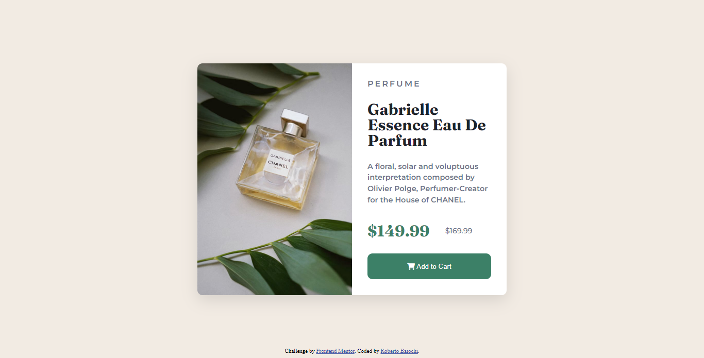

# Frontend Mentor - Product preview card component solution

This is a solution to the [Product preview card component challenge on Frontend Mentor](https://www.frontendmentor.io/challenges/product-preview-card-component-GO7UmttRfa). Frontend Mentor challenges help you improve your coding skills by building realistic projects. 

## Table of contents

- [Overview](#overview)
  - [The challenge](#the-challenge)
  - [Screenshot](#screenshot)
  - [Links](#links)
- [My process](#my-process)
  - [Built with](#built-with)
  - [What I learned](#what-i-learned)
  - [Continued development](#continued-development)
- [Author](#author)
- [Acknowledgments](#acknowledgments)

## Overview
 It was a cool challenge :)
### The challenge

Users should be able to:

- View the optimal layout depending on their device's screen size
- See hover and focus states for interactive elements

### Screenshot

### Links

-Live Url : https://robertobaiochi.github.io/frontEndMentor-cardChallage/

## My process

### Built with

- Semantic HTML5 markup
- CSS custom properties
- Flexbox
- @media-Queries

**Note: These are just examples. Delete this note and replace the list above with your own choices**

### What I learned

I was able to better understand the way the flex-box is applied, alignments and directions, I also found interesting the way in which I could use the image in a volatile way.

### Continued development

"Media Queries" is really a challenge, but I'm learning ways to make the layout more responsive and more pleasant, I know this layout wasn't excellent, but I'll keep studying to improve it.

## Author

- Frontend Mentor - [@RobertoBaiochi](https://www.frontendmentor.io/profile/RobertoBaiochi)

## Acknowledgments

I thank the entire community, it's unbelievable the amount of good people I ended up meeting as soon as I started studying, you guys are inspiring and I hope one day I can be too.
